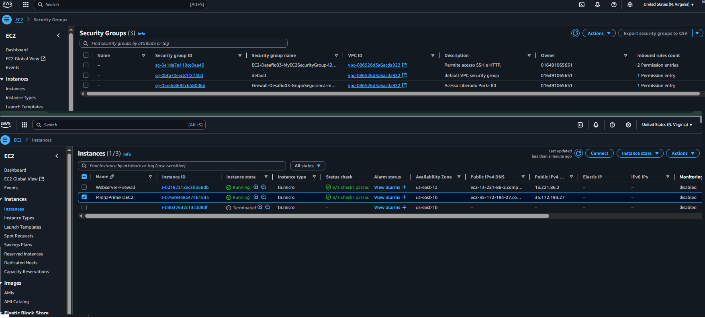
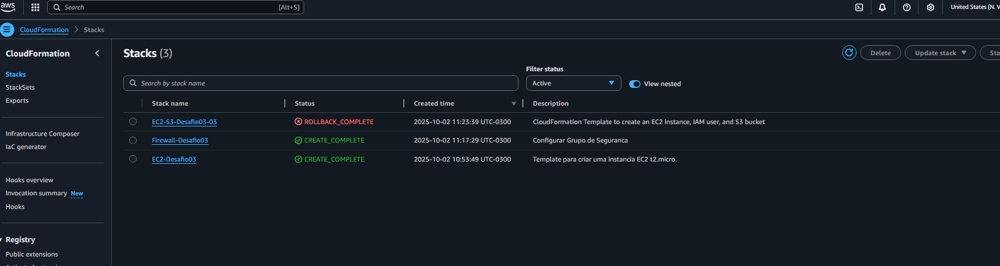
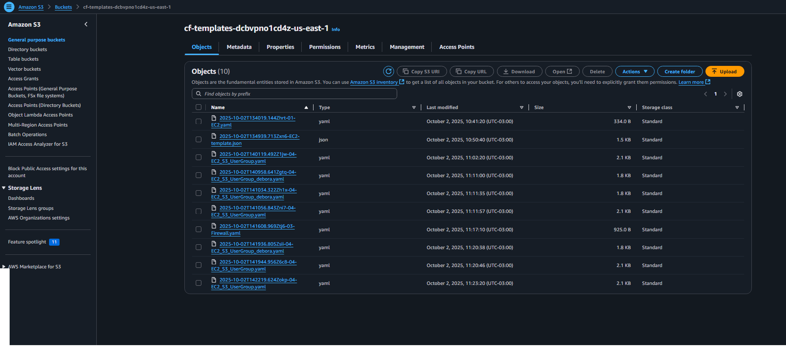
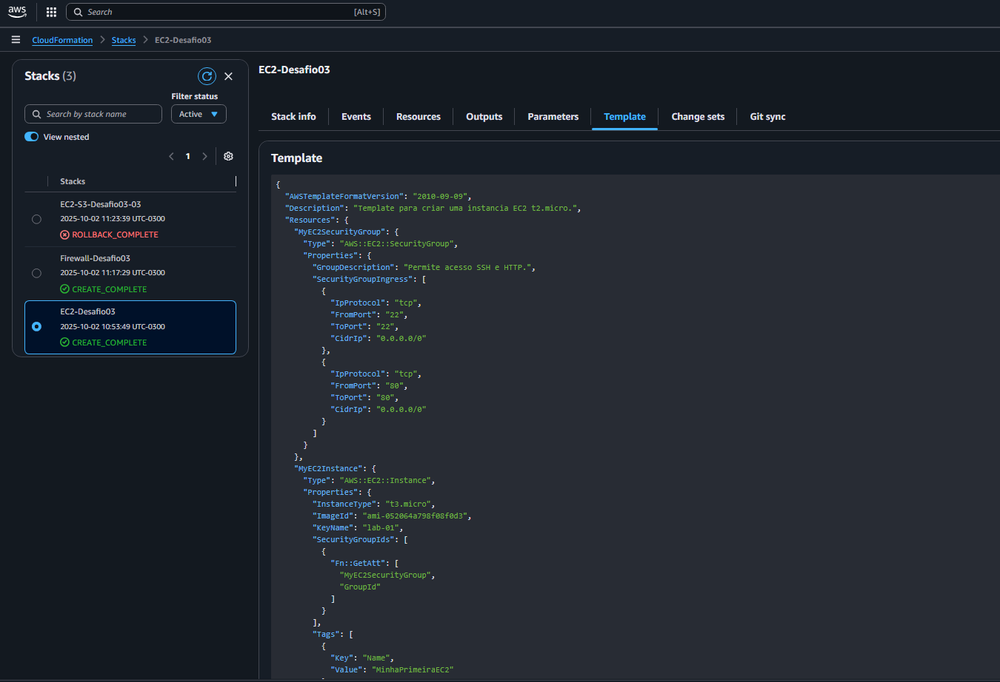

# AWS-CloudFormation
AWS CloudFormation é um serviço que modela e configura seus recursos da AWS. Ele permite a definição da infraestrutura de sua aplicação como código, usando templates em formato JSON ou YAML.

Em vez de criar e gerenciar seus recursos (como instâncias EC2, bancos de dados RDS ou buckets S3) manualmente no console da AWS, você pode simplesmente descrever todos eles em um template. O CloudFormation então lê esse template e provisiona os recursos de forma automatizada, eficiente e segura.

## Características Principais
  * Templates como Código: A infraestrutura é definida em um arquivo de texto. Isso permite que você trate a infraestrutura da mesma forma que o código de sua aplicação, usando controle de versão (como o Git), revisões e colaboração.

  * Gerenciamento de Stacks: O CloudFormation gerencia um conjunto de recursos relacionados como uma única unidade, chamada de stack. Seus recursos são criados, atualizados e excluídos em conjunto, o que simplifica o gerenciamento de ambientes inteiros.

  * Rollback Automático: Em caso de falha durante a criação ou atualização de um stack, o CloudFormation reverte automaticamente todas as mudanças, restaurando o ambiente ao seu estado anterior. Isso garante a consistência e evita a criação de recursos parciais.

  * Previsão de Mudanças (Change Sets): Você pode visualizar as mudanças que a atualização de um template causará em sua stack existente antes de aplicá-las. Isso permite que você revise o impacto das alterações e garanta que tudo funcione como esperado.

## Vantagens

  * Automação e Repetibilidade: Permite replicar sua infraestrutura de forma consistente em diferentes ambientes (como desenvolvimento, teste e produção) sem erros manuais.

  * Consistência e Padronização: Garante que todos os recursos em sua aplicação sigam o mesmo padrão e configuração, o que é essencial para ambientes de produção.

  * Controle de Versão: Ao armazenar os templates em um repositório como o GitHub, você tem um histórico completo de todas as alterações na sua infraestrutura.

  * Redução de Custos: A automação e a previsibilidade evitam o provisionamento de recursos desnecessários e otimizam o uso de serviços da AWS.

# Descrição da criação da primeira Stack com AWS ClaoudFormation
Neste projeto, o objetivo foi testar e demonstrar a automação e o poder de gerenciamento de infraestrutura como código (IaC) da AWS CloudFormation. Fiz a implantação de três templates, cada um responsável por provisionar um conjunto específico de recursos na AWS.

## O Desafio de Rollback️
Durante a execução, o primeiro e o segundo templates foram implantados com sucesso, criando seus respectivos stacks e recursos sem problemas. No entanto, o terceiro template, que orquestrava uma parte crítica da infraestrutura, não completou sua execução.

Apesar de ter falhado, a confiabilidade do CloudFormation se mostrou essencial. Ao identificar o erro na criação de um recurso, o serviço acionou o mecanismo de rollback automático. Isso garantiu que todos os recursos criados por este template fossem apagados, retornando o stack ao seu estado original antes da falha.

Esta experiência ressaltou um ponto crucial: o CloudFormation não apenas automatiza o processo de implantação, mas também age como uma rede de segurança vital, protegendo o ambiente contra infraestruturas incompletas ou corrompidas.

## Templates do Projeto
  * Template 1: Criação de uma instância EC2 do tipo t3.micro com um grupo de segurança associado com acesso HTTP e SSH, onde o template esta anexo com o nome de:  

    Status: Concluído com sucesso. ✅

  * Template 2: Criação de uma instância EC2 do tipo t3.micro para a inicialização de um servidor de firewall. O template está em anexo com o nome de: 

    Status: Concluído com sucesso. ✅
    

Figura 1 - Instâncias e Security Group Criados

 * Template 3: Criar 3 tipos de recursos, garantindo que eles sejam configurados de forma segura e padronizada.
   * Instância EC2: Provisiona uma máquina virtual (t3.micro por padrão) com um sistema operacional Ubuntu. O template configura automaticamente a AMI correta para a região em que está sendo executado e instala o python3-pip na inicialização.
   *  Grupo de Segurança (Security Group): Cria um firewall virtual para a instância EC2, permitindo tráfego de entrada na porta 22 (para acesso via SSH) de qualquer IP, o que facilita o acesso para configuração.
   *  Bucket S3: Cria um bucket para armazenamento de arquivos, com o nome s3-foundtion.
   *  Usuário e Grupo IAM: Provisiona um grupo de usuários chamado GPO-ADMIN-LAB e um usuário (debora.mendes) que é automaticamente adicionado a esse grupo. Essa é uma prática de segurança recomendada para gerenciar acessos.
arquivo em anexo do template: 

Status: Falha de execução e rollback bem-sucedido. ⚠️

### Apesar de não ter concluído com sucesso todo o template, a AWS CloudFormation conseguiu criar o Security Group, o Bucket S3 porém não concluiu com sucesso a instância e a criação do usuário.

Figura 2 - Stacks 

Figura 3 - Buckets S3 Criados

Figura 4 - Template 1 

## Conclusão e Lições Aprendidas
Este desafio prático foi uma oportunidade para entender o valor do CloudFormation no gerenciamento de riscos em implantações de larga escala. A capacidade de um serviço de reverter automaticamente uma falha é um fator decisivo para a construção de arquiteturas resilientes.

 Com este projeto, aprofundei meus conhecimentos sobre:

 * Modelagem de recursos em templates JSON.

 * Interpretação de logs de erro do CloudFormation.

 * Confiança na robustez do sistema de rollback para evitar problemas maiores.
